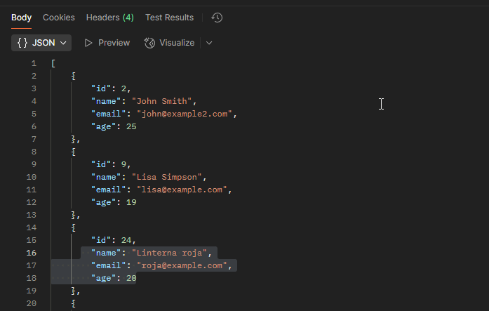
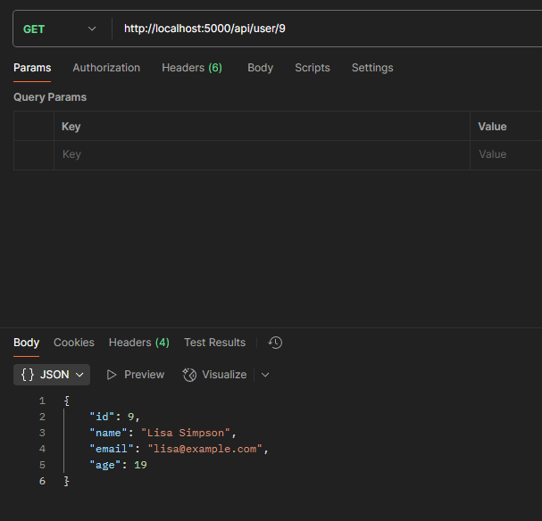
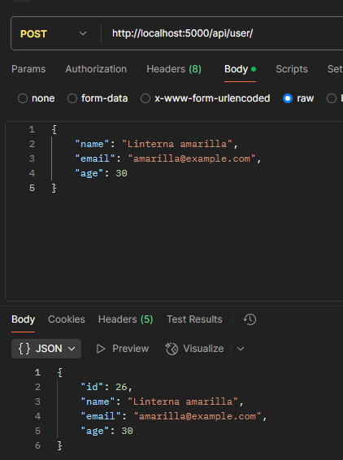
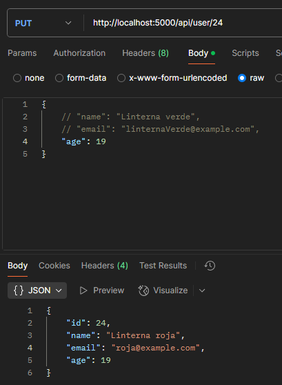
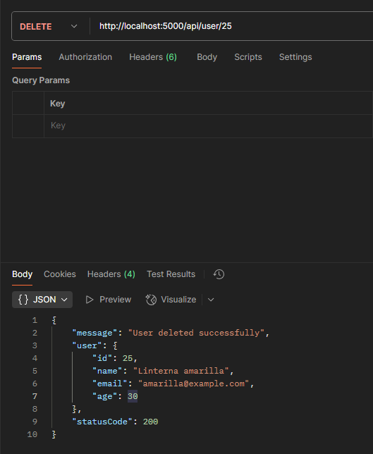
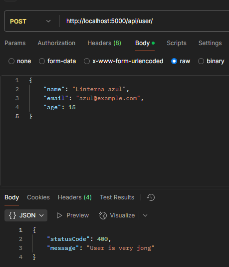
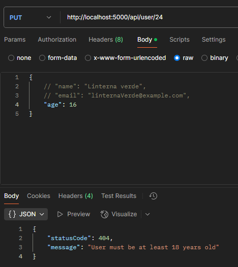

## CRUD USUARIO

Este proyecto proporciona una API RESTful para la gestión de usuarios. Los endpoints disponibles permiten realizar operaciones CRUD (Crear, Leer, Actualizar, Eliminar) sobre los usuarios. A continuación, se detallan los endpoints disponibles y sus funcionalidades:

## Endpoints

- `GET /api/users` ➔ Recupera una lista de usuarios



- `GET /api/users/{id}` ➔ Recupera un usuario específico por ID



- `POST /api/users` ➔ Crea un nuevo usuario



- `PUT /api/users/{id}` ➔ Actualiza un usuario existente por ID



- `DELETE /api/users/{id}` ➔ Elimina un usuario por ID



## Validación mayor de edad

### usario no creado menor de edad



### Actualizar usuario a menor de edad



## Clonar y ejecutar

1. Clonar el repositorio:
    ```bash
    git clone https://github.com/usuario/AztroWebApplication1.git
    cd AztroWebApplication1
    ```

2. Restaurar paquetes NuGet:
    ```bash
    dotnet restore
    ```

3. Compilar el proyecto:
    ```bash
    dotnet build
    ```

4. Ejecutar la aplicación:
    ```bash
    dotnet run
    ```

5. Abrir el navegador y navegar a `https://localhost:5001` para ver la aplicación en funcionamiento.